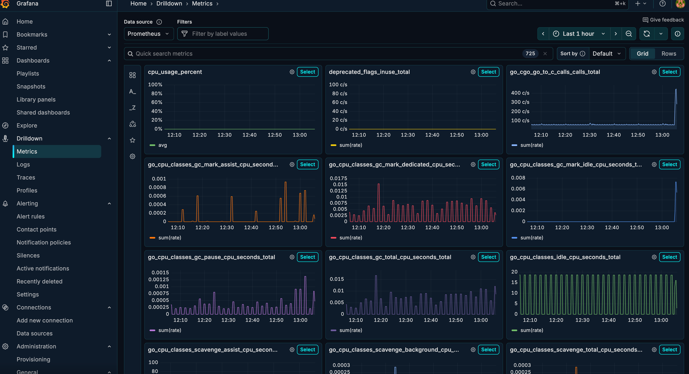

# Todos Golang API application

> `MENU` **README** | [CLI commands](#cli-commands) | [Available Branchs](#available-branchs) | [About me](#about-me) | [License](#license)

Created to study Golang

## Motivation

I'm a Ruby Developer with many years of experience, but I need to learn a new language to up my mindset. So, I decided to study Golang and its approachs.

## Features

- [x] Authentication (JWT)
- [x] Database (SQLite)
- [x] Logging
- [x] Telemetry (OpenTelemetry)
- [x] Monitoring (Prometheus, Grafana, Tempo)
- [x] Docker (Docker Compose)

## Screenshots




## CLI commands

I didnt use Makefile instead I used to Taskfile ([taskfile.yml](taskfile.yml))

> To see all available commands, use `task --list-all`

```bash
* build-all:
* cover:
* default:  
* dev: 
* test:                          (aliases: t)
* test-watch:                    (aliases: tw)
* g:migration:             
* migrate:down:                  (aliases: md)
* migrate:up:                    (aliases: mu)
* monitoring:logs:               (aliases: mon:logs)
* monitoring:setup:              (aliases: mon:setup)
* monitoring:start:              (aliases: mon:start)
* monitoring:status:             (aliases: mon:status)
* monitoring:stop:               (aliases: mon:stop)
* run:monitored:                 (aliases: run:mon)
```

## Available Branchs

> [!NOTE]
> Based on this article:
> 
> https://medium.com/@smart_byte_labs/organize-like-a-pro-a-simple-guide-to-go-project-folder-structures-e85e9c1769c2

| Branch | Description |
| ------ | ------------ |
| [main](https://github.com/thadeu/todos_api_golang/tree/main) | Principal branch |
| [002_layered_structure](https://github.com/thadeu/todos_api_golang/tree/002_layered_structure) | Build with layers, most common Golang applications |
| [003_domain_driven_design](https://github.com/thadeu/todos_api_golang/tree/003_domain_driven_design) | DDD Struct |
| [004_clean_arch](https://github.com/thadeu/todos_api_golang/tree/004_clean_arch) | Clean Archicture basic application |
| 005_module_structure | Each folder has its own structure, handlers, services, models and logic |
| 006_feature_based | Mix of Layers and Modules, the internal contains a module inside it |
| [007_hexagonal](https://github.com/thadeu/todos_api_golang/tree/007_hexagonal_architecture) | Famous Ports and Adapters, difficult to explain, but it's a mix of everything |

## Bin Aliases

Create an alias from bin's to /usr/loca/bin to easy run tests via CLI

```bash
sudo ln -fs $(pwd)/bin/gotest /usr/local/bin/gotest

sudo ln -fs $(pwd)/bin/gocover /usr/local/bin/gocover
```

## About me

[Thadeu Esteves Jr](https://github.com/thadeu) created this project to study Golang and its approaches. You can use it as you want, but I would appreciate if you could give me a star or follow me on GitHub.

To contact me use my email or social media links below.

- 📨 Email: [thadeu@gmail.com](mailto:dev@thadeu.org)
- 🔗 LinkedIn: [Thadeu Esteves Jr](http://linkedin.com/in/thadeuestevesjr)
- 🐙 GitHub: [Thadeu Esteves Jr](https://github.com/thadeu)
- 🐦 X(twitter): [Thadeu Esteves Jr](https://x.com/iamthadeu)

## License

See [LICENSE](LICENSE) file to understand my mindset about this.